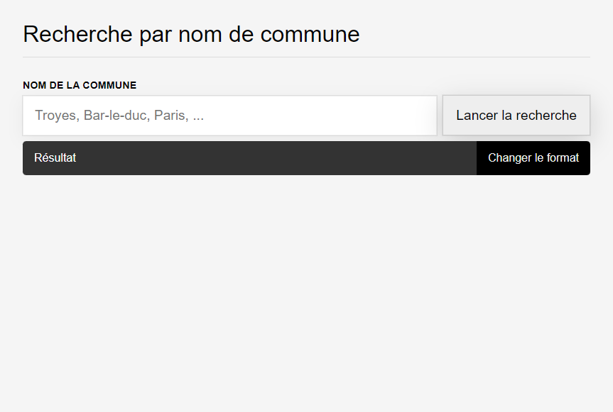
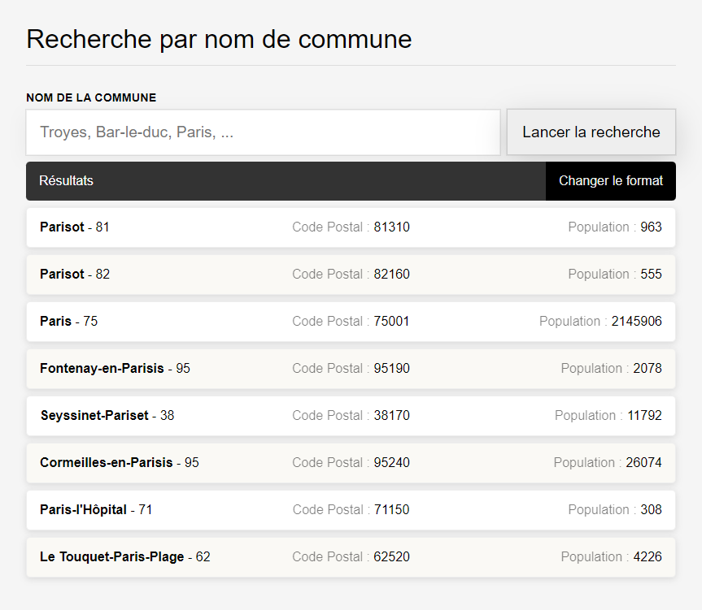
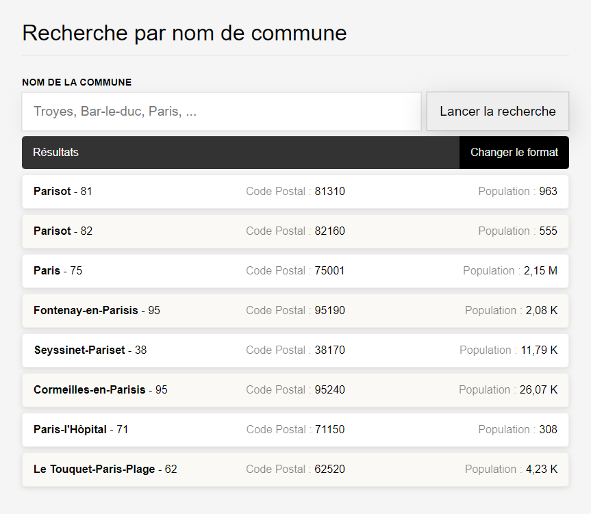

# Trouve ta ville

Trouve ta ville est un projet utilisant l'API du gouvernement https://geo.api.gouv.fr/decoupage-administratif/communes

Objectifs :

  - Décrire une interface déjà statique
  - Ajouter la recherche à la soumission du formulaire
  - Ajouter le formattage de l'affichage de la population, pour cette partie on va mettre en place des tests unitaires en prime

Voici l'interface attendue

Ecran d'accueil

Ecran de résultat

Après changement de format de la population

